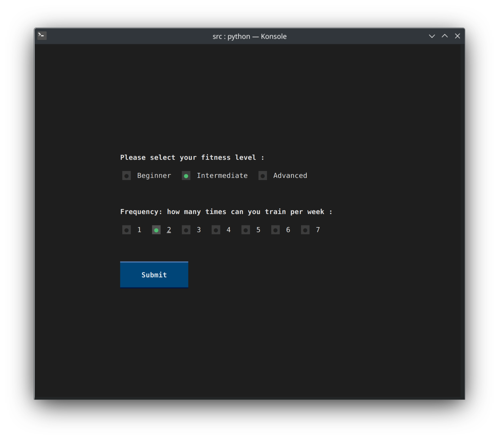

# 💪 fitness-agent
Vue profile | Vue agent
:-------------------------:|:-------------------------:
 | 

Un agent IA pour le fitness, basé sur `ChatGPT`, construit avec [Textual](https://textual.textualize.io).

## Installation

1. Installer Python sur sa machine

2. Cloner ce dépôt git sur sa machine

   ```bash
   $ git clone https://github.com/a-zurcher/fitness-agent
   ```

3. Créer un environnement virtuel Python:

   ```bash
   cd /path/to/fitness-agent
   python -m venv venv
   ```

4. Activer environnement virtuel:

   - Mac OS / Linux

     ```bash
     source venv/bin/activate
     ```

   - Windows (Powershell)

     ```powershell
     venv\Scripts\activate
     ```

5. Installer les dépendances:

   ```bash
   pip install -r requirements.txt
   ```

6. Faire une copie du fichier `.env.example` vers `.env` :

   ```
   cp .env.example .env
   ```

7. Ajouter [la clé](https://beta.openai.com/account/api-keys) OpenAI dans le nouveau fichier `.env`:

   ```bash
   OPENAI_API_KEY=YOUR_KEY_HERE
   ```

8. Pour lancer l'application :

   ```bash
   cd src
   python App.py
   ```

   En mode développeur, avec auto reload :

   ```bash
   textual run --dev App.py
   ```

   Il est également possible d'avoir une console de débuggage
   ```bash
   textual console -x EVENT
   # -x EVENT est utilisé pour rendre l'output moins verbeux
   ```
